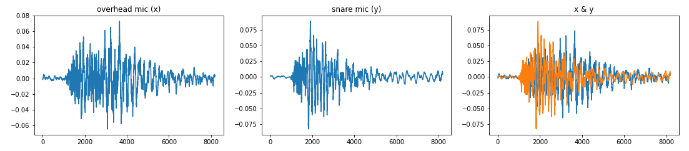
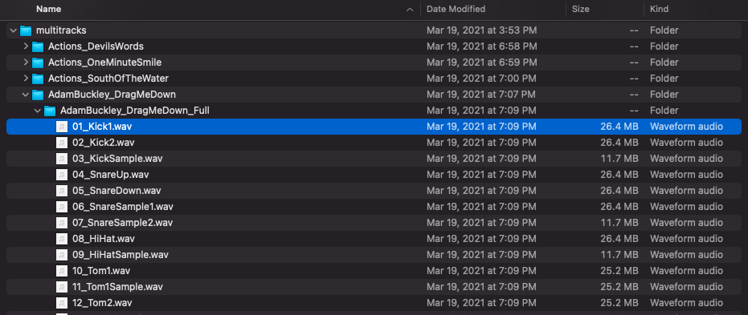

# Cambridge-Multitrack-Dataset
Tools for downloading, sorting and analyzing the [Cambridge Multitracks library](https://www.cambridge-mt.com/ms/mtk/) for machine learning applications.

A few examples on how it can be used:

[Here](https://github.com/carlmoore256/Mic-Bleed-Removal-CNN), I train a UNet CNN to isolate and mask microphone bleed in similar manner to musical source separation. Pairs of coincident transient events are extracted and aligned from "overhead" and "snare" drum microphones, and saved as a dataset for training.



[In this project](https://github.com/carlmoore256/NextBlock) I use several hundred hours of vocal tracks to train an unsupervised learning signal reconstruction model, intended for repairing dropouts in low-latency audio calls between musicians.

## Installation
- Download repo and install dependencies
```bash
git clone https://github.com/carlmoore256/Cambridge-Multitrack-Dataset
pip install -r requirements.txt
```

## Getting Started
### Build a local library using the download utility

- Download all available multitrack stems and unzip them into provided directory (default is "./multitracks")
```bash
python download_stems.py
```



#### This will take a long time, since we are retrieving several hundred GBs of WAV files

- (Optional) Download only a single genre using the --genre argument
```bash
python download_stems.py --genre Pop
```
#### Available genre filters: Pop, Electronica, Acoustic, HipHop

This may not seem like an exhaustive list, but this is actually just the html tags. Browse [the website](https://www.cambridge-mt.com/ms/mtk/) for a better idea about what's included in each of these.

* Folder checks avoid re-downloading parts of your local library
* Zip files are stored in "./temp" until they are unzipped

### Download a smaller subset
- Download n examples from a randomly selected pool, instead of downloading the entire library
```bash
python download_stems.py --subset 10
```

## Dataset Label Mapping
Labels for stems are generated by matching a list of search parameters to filenames. 
extract_labels.py saves a json map of files and associated labels.

### Create a custom mapping
- Modify or create keywords.txt to specify custom search parameters
```bash
python extract_labels.py -kw /path/to/keywords.txt
```

## Filter/Verify Audio Stems
To improve the accuracy of the dataset, [YAMNet](https://github.com/tensorflow/models/tree/master/research/audioset/yamnet) can be used to generate a dataset map containing sample indicies of "verified" matches between the audio content and a provided keyword label. This process also removes periods of silence using the strip_silence function.

### Create custom verified dataset map using YAMNet
- Cross check all stems marked as "vox" with AudioSet classes ["Speech"](https://research.google.com/audioset/dataset/speech.html) and ["Singing"](https://research.google.com/audioset/dataset/singing.html), while rejecting ["Silence"](https://research.google.com/audioset/dataset/silence.html)
```bash
python yamnet_verify.py -kw vox --approve Speech Singing --reject Silence
```

- Change the dB threshold for silence removal before processing (reduces number of inferences required)
```bash
python yamnet_verify.py -kw bass --approve "Bass guitar" --reject Silence --thresh 35
```

- Combine filters for specific tones, such as a *clean* guitar tone
```bash
python yamnet_verify.py -kw gtr --approve Guitar --reject Distortion Silence
```

## Create a transient-aligned dataset
Automatically find stems containing x, y pairs of correlated transients for regressive models

- Create a dataset containing correlated transients from overhead mics (x) and snare mics (y), with a window size of 8192 samples/clip


```bash
python transient_verify.py --xkey overhead --ykey snare --ws 8192
```